# Sentinella: Enterprise AI Gateway & Evaluation Platform

> **A centralized AI Gateway that provides unified access to multiple LLM providers with intelligent routing, automatic fallback, response caching, multi-tenancy, streaming, and comprehensive observability.**

[](https://www.python.org/)
[](https://fastapi.tiangolo.com/)
[](LICENSE)

<div align="center">
  
  <p><em>System Architecture Overview</em></p>
  
  
  <p><em>Complete System Components</em></p>
</div>

## 📋 Table of Contents

- [Overview](#overview)
- [Architecture](#architecture)
- [Core Features](#core-features)
- [Request Flow](#request-flow)
- [Supported Models](#supported-models)
- [Installation](#installation)
- [Usage](#usage)
- [SDKs](#sdks)
- [Evaluation Framework](#evaluation-framework)
- [Infrastructure](#infrastructure)
- [Project Structure](#project-structure)
- [Technology Stack](#technology-stack)
- [API Reference](#api-reference)
- [License](#license)

## 🎯 Overview

Sentinella is an enterprise-grade AI Gateway that acts as a unified interface between applications and multiple LLM providers (OpenAI, Anthropic, Google Gemini, Grok, DeepSeek, and more). Instead of integrating directly with each provider, applications communicate through Sentinella, which handles intelligent routing, caching, fallback strategies, multi-tenancy, streaming, and observability.

### What Sentinella Does

- **Unified API**: Single endpoint for all LLM providers (25+ models across 8 providers)
- **Intelligent Routing**: ML-based model selection considering complexity, cost, and latency
- **Smart Fallback**: Automatic retry and fallback to alternative models on failure
- **Response Caching**: Redis-based caching with semantic similarity search
- **Multi-Tenancy**: Complete tenant isolation with per-tenant rate limits and cost controls
- **Streaming Support**: Real-time streaming responses via Server-Sent Events
- **Conversational Memory**: Session-based memory management for context-aware conversations
- **Prompt Templates**: Versioned prompt templates with variable substitution
- **Function Calling**: Native support for tool/function calling
- **Fine-Tuning**: Integration with fine-tuned models
- **Webhooks**: Event-driven webhooks for completions, errors, and cost thresholds
- **Full Observability**: LangFuse integration for request tracing and metrics
- **Evaluation Pipeline**: Automated quality assessment and model comparison

## 🏗️ Architecture

### System Architecture

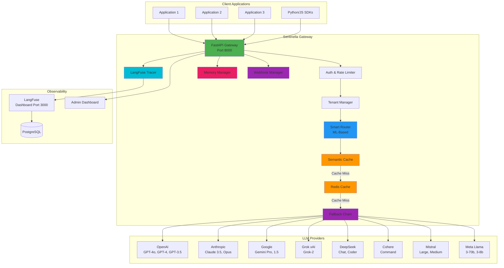

### Complete Request Flow

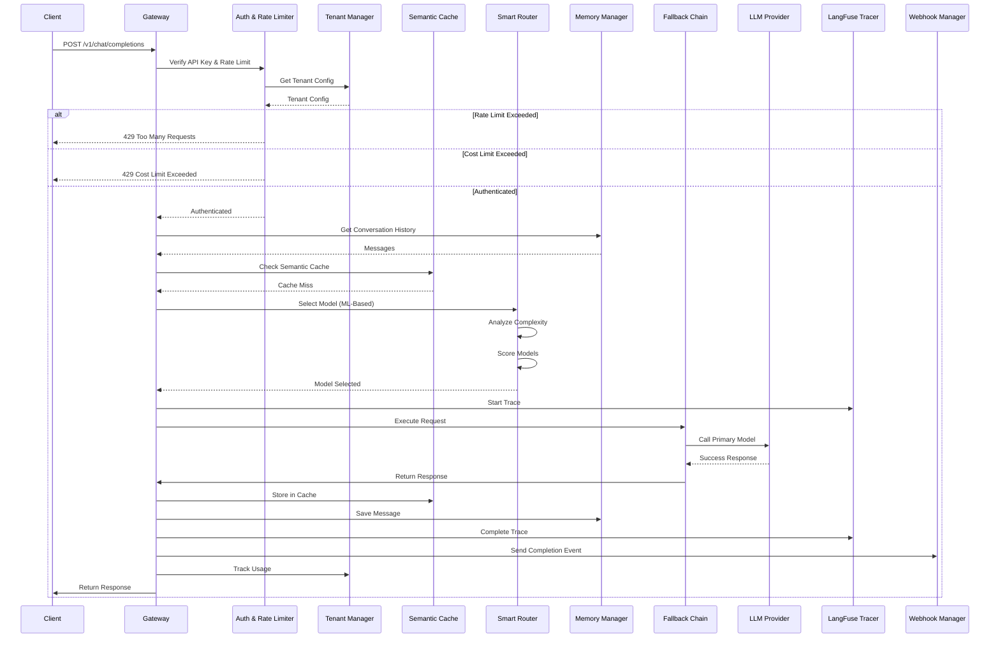

## 🔧 Core Features

### 1. Intelligent ML-Based Routing

The Smart Router uses machine learning algorithms to analyze prompts and select optimal models:

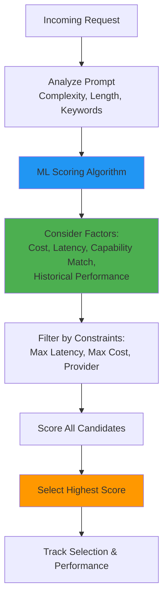

**Routing Factors:**
- **Input Complexity**: ML-based complexity scoring (0.0-1.0)
- **Task Type Detection**: Code, reasoning, translation, general
- **Cost Efficiency**: Routes to cheaper models when quality threshold is met
- **Latency Constraints**: Respects maximum latency requirements
- **Historical Performance**: Tracks success rates and latency per model
- **Provider Preferences**: Supports tenant-specific provider preferences

### 2. Multi-Tenancy & Rate Limiting

Complete tenant isolation with configurable limits:

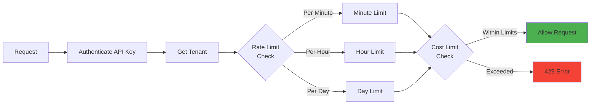

**Features:**
- Per-tenant API keys
- Configurable rate limits (per minute, hour, day)
- Daily and monthly cost limits
- Usage tracking per tenant
- Tenant-specific routing preferences

### 3. Semantic Caching

Advanced caching using embeddings for similarity-based cache hits:

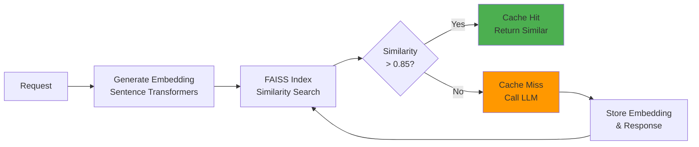

**Benefits:**
- Finds similar cached responses even if prompts aren't identical
- Reduces costs for semantically similar queries
- Configurable similarity threshold (default: 0.85)
- Uses FAISS for fast similarity search

### 4. Streaming Responses

Real-time streaming via Server-Sent Events:

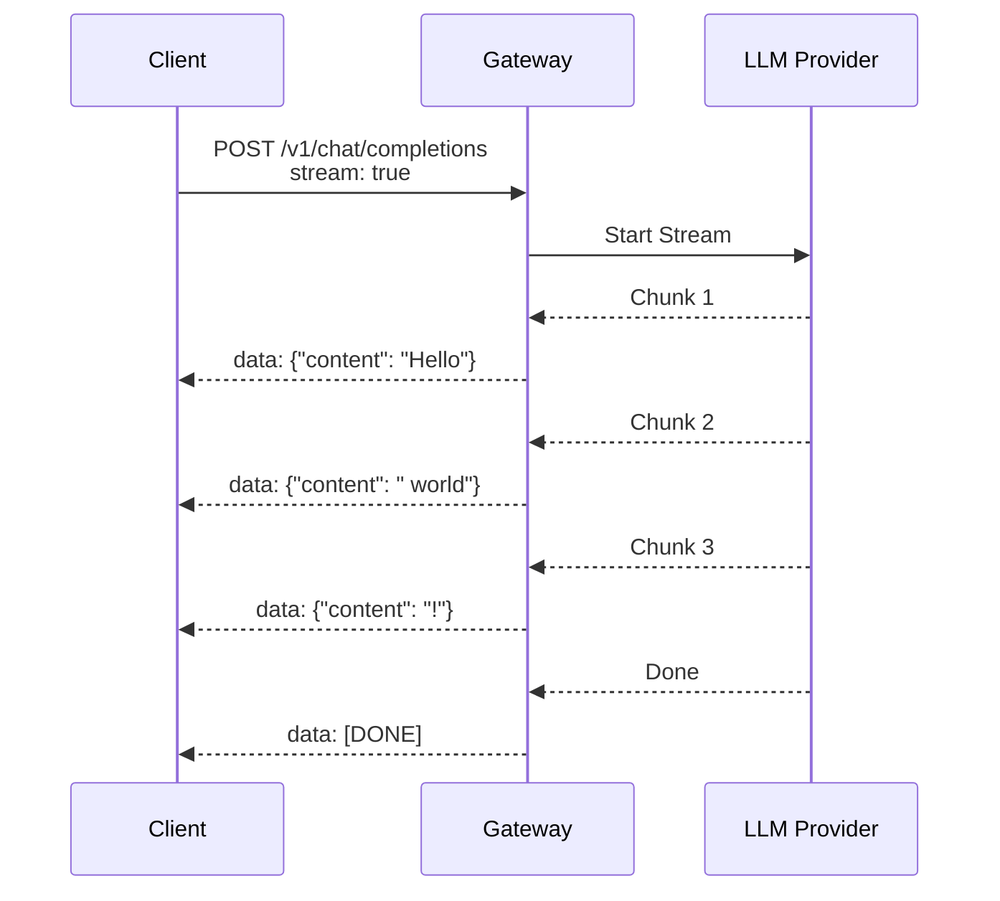

### 5. Conversational Memory

Session-based memory management for context-aware conversations:

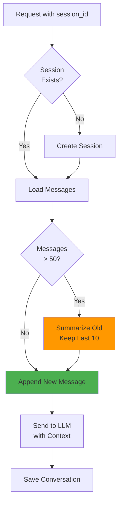

### 6. Smart Fallback Chain

Automatic retry and fallback with provider diversity:

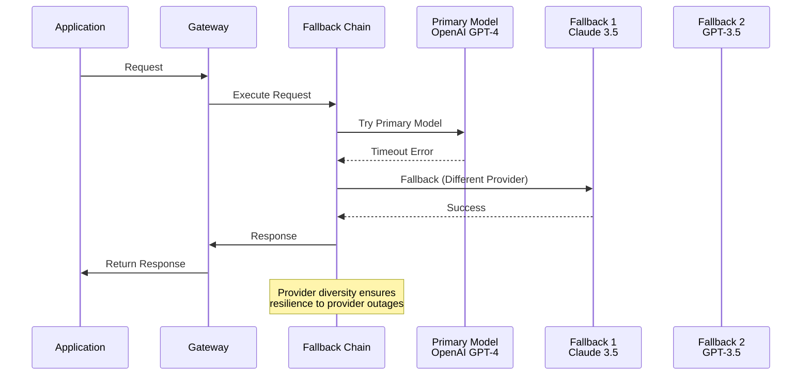

### 7. Prompt Templates & Versioning

Versioned prompt templates with variable substitution:

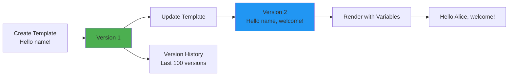

### 8. Function Calling / Tool Use

Native support for LLM function calling:

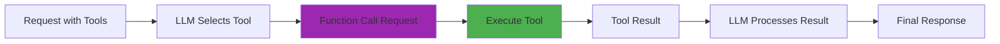

## 📊 Supported Models

Sentinella supports **25+ models** across **8 providers**:

### OpenAI (7 models)
- `gpt-4o` - Latest GPT-4 optimized model
- `gpt-4o-mini` - Cost-effective GPT-4 variant
- `gpt-4-turbo` - High-performance GPT-4
- `gpt-4` - Standard GPT-4
- `gpt-3.5-turbo` - Fast and cost-effective
- `gpt-4-1106-preview` - Preview model
- `gpt-4-0125-preview` - Preview model

### Anthropic Claude (4 models)
- `claude-3-5-sonnet-20241022` - Latest Claude 3.5
- `claude-3-opus-20240229` - Most capable Claude
- `claude-3-sonnet-20240229` - Balanced Claude
- `claude-3-haiku-20240307` - Fastest Claude

### Google Gemini (5 models)
- `gemini-pro` - Standard Gemini
- `gemini-pro-vision` - Multimodal Gemini
- `gemini-1.5-pro` - Advanced with 2M context window
- `gemini-1.5-flash` - Fast with 1M context window
- `gemini-ultra` - Most capable Gemini

### Grok / xAI (2 models)
- `grok-beta` - Beta Grok model
- `grok-2` - Latest Grok with 131K context

### DeepSeek (2 models)
- `deepseek-chat` - General purpose
- `deepseek-coder` - Code-optimized

### Cohere (2 models)
- `command` - Standard Cohere model
- `command-light` - Lightweight variant

### Mistral (3 models)
- `mistral-large` - Most capable Mistral
- `mistral-medium` - Balanced Mistral
- `mistral-small` - Cost-effective Mistral

### Meta Llama (2 models)
- `llama-3-70b` - Large Llama model
- `llama-3-8b` - Efficient Llama model

## 🚀 Installation

### Prerequisites

- Python 3.11+
- Docker & Docker Compose
- API keys for LLM providers

### Quick Start

1. **Clone the repository**
```bash
git clone https://github.com/yourusername/sentinella.git
cd sentinella
```

2. **Set up environment variables**
```bash
cp .env.example .env
# Edit .env with your API keys:
# - OPENAI_API_KEY
# - ANTHROPIC_API_KEY
# - GOOGLE_API_KEY
# - XAI_API_KEY (for Grok)
# - SENTINELLA_API_KEY
# - LANGFUSE_SECRET_KEY
# - LANGFUSE_PUBLIC_KEY
```

3. **Start services with Docker Compose**
```bash
docker-compose up -d
```

This starts:
- **Sentinella Gateway** on port 8000
- **Redis** on port 6379
- **LangFuse Dashboard** on port 3000
- **PostgreSQL** on port 5432 (for LangFuse)

4. **Verify installation**
```bash
curl http://localhost:8000/health
```

Expected response:
```json
{
  "status": "healthy",
  "cache": "connected",
  "version": "0.1.0"
}
```

## 💻 Usage

### Basic Request

```bash
curl -X POST http://localhost:8000/v1/chat/completions \
  -H "Content-Type: application/json" \
  -H "X-API-Key: your-sentinella-api-key" \
  -d '{
    "model": "gpt-3.5-turbo",
    "messages": [
      {"role": "user", "content": "Hello, world!"}
    ],
    "temperature": 0.7
  }'
```

### Automatic Model Selection

If you don't specify a model, Sentinella will automatically select the best model:

```bash
curl -X POST http://localhost:8000/v1/chat/completions \
  -H "Content-Type: application/json" \
  -H "X-API-Key: your-sentinella-api-key" \
  -d '{
    "messages": [
      {"role": "user", "content": "What is 2+2?"}
    ]
  }'
```

### Streaming Responses

```bash
curl -X POST http://localhost:8000/v1/chat/completions \
  -H "Content-Type: application/json" \
  -H "X-API-Key: your-sentinella-api-key" \
  -d '{
    "messages": [
      {"role": "user", "content": "Tell me a story"}
    ],
    "stream": true
  }'
```

### Conversational Memory

```bash
# First message
curl -X POST http://localhost:8000/v1/chat/completions \
  -H "Content-Type: application/json" \
  -H "X-API-Key: your-sentinella-api-key" \
  -d '{
    "messages": [
      {"role": "user", "content": "My name is Alice"}
    ],
    "session_id": "session-123"
  }'

# Follow-up (remembers context)
curl -X POST http://localhost:8000/v1/chat/completions \
  -H "Content-Type: application/json" \
  -H "X-API-Key: your-sentinella-api-key" \
  -d '{
    "messages": [
      {"role": "user", "content": "What is my name?"}
    ],
    "session_id": "session-123"
  }'
```

### Using Prompt Templates

```bash
# Create template
curl -X POST http://localhost:8000/v1/templates \
  -H "Content-Type: application/json" \
  -H "X-API-Key: your-sentinella-api-key" \
  -d '{
    "name": "greeting",
    "template": "Hello {name}, welcome to {company}!",
    "variables": ["name", "company"]
  }'

# Render template
curl -X POST http://localhost:8000/v1/templates/greeting/render \
  -H "Content-Type: application/json" \
  -H "X-API-Key: your-sentinella-api-key" \
  -d '{
    "variables": {
      "name": "Alice",
      "company": "Acme Corp"
    }
  }'
```

### Function Calling

```bash
curl -X POST http://localhost:8000/v1/chat/completions \
  -H "Content-Type: application/json" \
  -H "X-API-Key: your-sentinella-api-key" \
  -d '{
    "model": "gpt-4",
    "messages": [
      {"role": "user", "content": "What is the weather in San Francisco?"}
    ],
    "tools": [
      {
        "type": "function",
        "function": {
          "name": "get_weather",
          "description": "Get weather for a location",
          "parameters": {
            "type": "object",
            "properties": {
              "location": {"type": "string"}
            }
          }
        }
      }
    ]
  }'
```

### List Available Models

```bash
curl http://localhost:8000/v1/models \
  -H "X-API-Key: your-sentinella-api-key"
```

### Get Metrics

```bash
curl http://localhost:8000/metrics \
  -H "X-API-Key: your-sentinella-api-key"
```

## 📦 SDKs

### Python SDK

```python
import asyncio
from sentinella import SentinellaClient

async def main():
    async with SentinellaClient(
        api_key="your-api-key",
        base_url="http://localhost:8000"
    ) as client:
        # Simple chat
        response = await client.chat(
            messages=[{"role": "user", "content": "Hello!"}]
        )
        print(response["choices"][0]["message"]["content"])
        
        # Streaming
        async for chunk in client.chat_stream(
            messages=[{"role": "user", "content": "Tell me a story"}]
        ):
            print(chunk, end="", flush=True)
        
        # With conversational memory
        await client.chat(
            messages=[{"role": "user", "content": "My name is Alice"}],
            session_id="session-123"
        )
        
        response = await client.chat(
            messages=[{"role": "user", "content": "What's my name?"}],
            session_id="session-123"
        )
        print(response["choices"][0]["message"]["content"])  # "Alice"

asyncio.run(main())
```

**Installation:**
```bash
cd sdks/python
pip install -e .
```

### JavaScript/TypeScript SDK

```typescript
import SentinellaClient from '@sentinella/sdk';

const client = new SentinellaClient(
  'your-api-key',
  'http://localhost:8000'
);

// Simple chat
const response = await client.chat([
  { role: 'user', content: 'Hello!' }
]);
console.log(response.choices[0].message.content);

// Streaming
for await (const chunk of client.chatStream([
  { role: 'user', content: 'Tell me a story' }
])) {
  process.stdout.write(chunk);
}
```

**Installation:**
```bash
cd sdks/javascript
npm install
npm run build
```

## 🧪 Evaluation Framework

### Running Evaluations

Evaluate a single model against the golden dataset:

```bash
python -m src.evaluator.evaluator \
  --model gpt-3.5-turbo \
  --dataset src/evaluator/datasets/golden_dataset.json \
  --output results.json
```

Compare multiple models:

```bash
python -m src.evaluator.evaluator \
  --compare gpt-4o-mini gpt-3.5-turbo claude-3-haiku \
  --dataset src/evaluator/datasets/golden_dataset.json
```

### Evaluation Metrics

The evaluation framework tracks:

- **Quality Score**: Semantic similarity to expected answers
- **Latency**: Response time in milliseconds
- **Cost**: Estimated cost per request
- **Token Usage**: Input/output token counts
- **Success Rate**: Percentage of successful requests

### Using Jupyter Notebooks

```bash
cd notebooks/evaluation
jupyter notebook evaluation_demo.ipynb
```

## 🏗️ Infrastructure

### Local Development (Docker Compose)

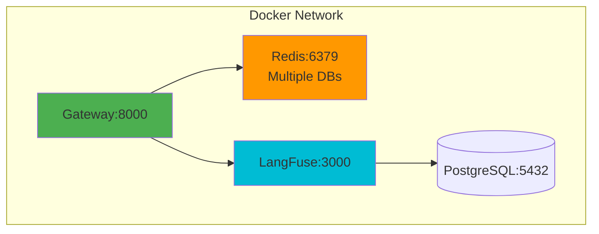

### Production Deployment (AWS EKS)

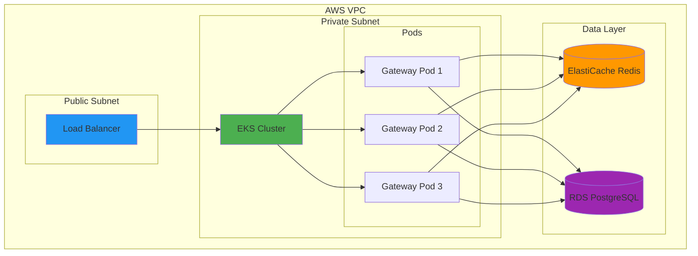

### Terraform Infrastructure

The project includes Terraform configurations for:

- VPC with public/private subnets
- ElastiCache Redis cluster
- RDS PostgreSQL instance
- EKS cluster (basic configuration)
- Security groups and IAM roles

### Kubernetes Deployment

Helm charts are provided for:

- Gateway deployment with auto-scaling
- Service configuration
- Horizontal Pod Autoscaler (HPA)
- ConfigMaps and Secrets management

## 📁 Project Structure

```
sentinella/
├── src/
│   ├── gateway/              # FastAPI application
│   │   ├── __init__.py
│   │   ├── main.py          # API entry point
│   │   └── models.py        # Pydantic schemas
│   ├── router/              # Intelligent routing
│   │   ├── __init__.py
│   │   ├── router.py        # ML-based model selection
│   │   └── fallback.py      # Fallback strategies
│   ├── cache/               # Redis caching
│   │   ├── __init__.py
│   │   ├── redis_client.py   # Regular cache
│   │   └── semantic_cache.py # Semantic similarity cache
│   ├── tenancy/             # Multi-tenancy
│   │   ├── __init__.py
│   │   └── tenant_manager.py
│   ├── rate_limiter/        # Rate limiting
│   │   ├── __init__.py
│   │   └── limiter.py
│   ├── streaming/           # Streaming support
│   │   ├── __init__.py
│   │   └── stream_handler.py
│   ├── memory/              # Conversational memory
│   │   ├── __init__.py
│   │   └── memory_manager.py
│   ├── prompts/            # Prompt templates
│   │   ├── __init__.py
│   │   ├── template_manager.py
│   │   └── optimizer.py
│   ├── tools/              # Function calling
│   │   ├── __init__.py
│   │   └── tool_manager.py
│   ├── webhooks/           # Webhook system
│   │   ├── __init__.py
│   │   └── webhook_manager.py
│   ├── finetuning/        # Fine-tuning support
│   │   ├── __init__.py
│   │   └── finetune_manager.py
│   ├── connection_pool/   # Connection pooling
│   │   ├── __init__.py
│   │   └── pool_manager.py
│   ├── async_processing/  # Background jobs
│   │   ├── __init__.py
│   │   └── queue_manager.py
│   ├── dashboard/          # Admin dashboard
│   │   ├── __init__.py
│   │   └── routes.py
│   ├── observability/      # LangFuse integration
│   │   ├── __init__.py
│   │   └── tracer.py
│   ├── evaluator/         # Evaluation pipeline
│   │   ├── __init__.py
│   │   ├── evaluator.py
│   │   └── datasets/
│   │       └── golden_dataset.json
│   └── models/            # Data models
│       ├── __init__.py
│       ├── tenant.py
│       ├── prompt_template.py
│       ├── conversation.py
│       └── webhook.py
├── sdks/
│   ├── python/            # Python SDK
│   │   ├── sentinella/
│   │   │   ├── __init__.py
│   │   │   └── client.py
│   │   └── setup.py
│   └── javascript/        # JavaScript/TypeScript SDK
│       ├── src/
│       │   └── index.ts
│       ├── package.json
│       └── tsconfig.json
├── infra/
│   ├── terraform/         # AWS infrastructure
│   │   ├── main.tf
│   │   ├── variables.tf
│   │   └── outputs.tf
│   └── kubernetes/        # K8s deployment
│       └── helm/
│           └── sentinella-chart/
├── tests/                 # Test suite
│   ├── test_router.py
│   └── test_cache.py
├── notebooks/             # Jupyter notebooks
│   └── evaluation/
│       └── evaluation_demo.ipynb
├── docker-compose.yml     # Local development
├── Dockerfile            # Container image
├── requirements.txt      # Python dependencies
├── pyproject.toml       # Project configuration
└── README.md            # This file
```

## 🛠️ Technology Stack

| Component | Technology | Purpose |
|-----------|-----------|---------|
| **API Framework** | FastAPI | High-performance async API |
| **LLM Abstraction** | LiteLLM | Unified interface for LLM providers |
| **Caching** | Redis | Response caching layer |
| **Semantic Cache** | FAISS + Sentence Transformers | Similarity-based caching |
| **Observability** | LangFuse | LLM-specific tracing and metrics |
| **Database** | PostgreSQL | LangFuse data storage |
| **Rate Limiting** | Redis + SlowAPI | Distributed rate limiting |
| **Connection Pooling** | httpx | HTTP connection reuse |
| **Async Processing** | Redis Queues | Background job processing |
| **Infrastructure** | Terraform | Infrastructure as Code |
| **Orchestration** | Kubernetes/Helm | Container orchestration |
| **Cloud Provider** | AWS | EKS, ElastiCache, RDS |

## 🔐 Security

- **API Key Authentication**: All requests require valid API keys via `X-API-Key` header
- **Multi-Tenancy**: Complete tenant isolation
- **Rate Limiting**: Per-tenant rate limits and cost controls
- **Environment Variables**: Sensitive credentials stored in environment variables
- **Secrets Management**: Kubernetes secrets for production deployments
- **Network Isolation**: VPC configuration with private subnets
- **Webhook Signatures**: HMAC-SHA256 signature verification for webhooks

## 📝 API Reference

### POST /v1/chat/completions

Main endpoint for chat completions with support for streaming, memory, and function calling.

**Request:**
```json
{
  "model": "gpt-3.5-turbo",  // Optional, auto-selected if omitted
  "messages": [
    {"role": "user", "content": "Hello!"}
  ],
  "temperature": 0.7,        // Optional
  "max_tokens": 100,         // Optional
  "stream": false,           // Optional, enable streaming
  "session_id": "session-123", // Optional, for conversational memory
  "tools": []                // Optional, for function calling
}
```

**Response:**
```json
{
  "id": "chatcmpl-123",
  "model": "gpt-3.5-turbo",
  "choices": [...],
  "usage": {
    "prompt_tokens": 10,
    "completion_tokens": 20,
    "total_tokens": 30
  },
  "latency_ms": 1250.5,
  "cached": false
}
```

### GET /health

Health check endpoint.

**Response:**
```json
{
  "status": "healthy",
  "cache": "connected",
  "version": "0.1.0"
}
```

### GET /v1/models

List all available models (25+ models across 8 providers).

### GET /metrics

Get gateway metrics (cache stats, router stats, tenant usage).

### POST /v1/templates

Create a prompt template.

### POST /v1/templates/{id}/render

Render a template with variables.

### GET /api/dashboard/stats

Get overall gateway statistics (requires admin key).

## 🧪 Testing

Run tests:

```bash
# Install test dependencies
pip install -r requirements.txt

# Run all tests
pytest tests/ -v

# Run with coverage
pytest tests/ --cov=src --cov-report=html
```

## 📄 License

MIT License - see [LICENSE](LICENSE) file for details.

## 🙏 Acknowledgments

- [LiteLLM](https://github.com/BerriAI/litellm) for provider abstraction
- [LangFuse](https://github.com/langfuse/langfuse) for observability
- [FastAPI](https://fastapi.tiangolo.com/) for the web framework
- [FAISS](https://github.com/facebookresearch/faiss) for similarity search
- [Sentence Transformers](https://www.sbert.net/) for embeddings
